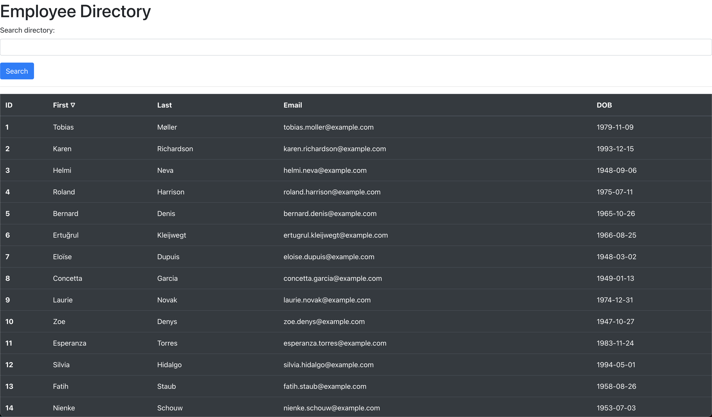

# Basic Employee Directory
## Description
Basic directory for searching and sorting through employees. This application utilizes React to build a dynamic user interface and responsive user experience.

## Table of Contents
- [Description](#Description)
- [Deployment](#Deployment)
- [Technologies](#Technologies)
- [Credits](#Credits)
- [Contributing](#Contributing)
- [License](#License)
  

## Deployment
- [GitHub Pages](https://jareddeuriarte.github.io/employee-directory/)
- [GitHub Repo](https://github.com/jareddeuriarte/employee-directory)
  

  

### Technologies
- React
- Node.js technology

### Credits  
My tutor Namita.

### Contributing
Forks are welcome!

### License 
This project is licensed under MIT.

### Badges

### Questions?
Reach me at:
- [GitHub](https://github.com/jareddeuriarte)
- deuriartejared@gmail.com

